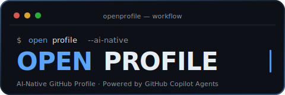

<div align="center">



<br/>

[](https://github.com/njueeRay/OpenProfile/stargazers)
[](https://github.com/njueeRay/OpenProfile/network/members)
[](https://github.com/njueeRay/OpenProfile/releases)
[](./LICENSE)
[](https://github.com/features/copilot)
[](https://github.com/njueeRay/OpenProfile/actions/workflows/markdown-lint.yml)
[](https://github.com/njueeRay/OpenProfile/actions/workflows/link-check.yml)

<br/>

**Stop hand-editing Markdown. Let an AI Agent team build your GitHub Profile.**

*OpenProfile is a complete, reproducible workflow — fork it, configure one file, and let Copilot Agents take over.*

<br/>

[](https://njueeray.github.io)
[](https://github.com/njueeRay/OpenProfile)

</div>

---

## Preview

<div align="center">

| 🖥️ GitHub Profile | 📝 Personal Blog |
|:-:|:-:|
| Dark terminal aesthetic with dynamic stats | Astro-powered blog with 16+ posts |
| WakaTime · Streak · Activity Graph · 3D Contrib | Content types · Tag filters · RSS · Giscus comments |
| [**→ Visit Profile**](https://github.com/njueeRay) | [**→ Visit Blog**](https://njueeray.github.io) |

</div>

---

## Why OpenProfile?

Most developer profiles are frozen in time  written once, then forgotten.

**OpenProfile** treats your GitHub Profile as a living, AI-maintained system:

| Without OpenProfile | With OpenProfile |
|---------------------|-----------------|
| Edit Markdown by hand | Describe goals in plain English; Agents implement |
| Hunt for badge URLs manually | Researcher Agent audits components for you |
| Push and hope it looks right | Code-Reviewer Agent validates before every merge |
| No context between sessions | Brain Agent maintains project memory & strategy |
| Hours for a redesign | Minutes with the right Agent and a clear prompt |

> **This is the exact repo that powers [@njueeRay](https://github.com/njueeRay)'s profile.** Fork it and it becomes yours.

---

## Features

- **Agent Team V2.0**  Brain, PM, Dev, Code-Reviewer and Researcher with formal handoff protocol
- **One-file config**  All personal data lives in `.github/copilot-instructions.md`
- **VS Code ready**  Toolset permissions and MCP server wired out of the box
- **Dynamic stats**  WakaTime, Contribution Snake, Activity Graph, GitHub Stats, 3D Contributions
- **GitHub Trophy**  `github-profile-trophy` achievement badges (darkhub theme, 1×6 layout)
- **Astro blog**  Full personal site at [njueeray.github.io](https://njueeray.github.io) with RSS feed, blog tag system, and bilingual posts
- **AI-native philosophy**  Team playbook encodes the AI-native person paradigm; full agent capability snapshots
- **CI/CD**  Link checker (Lychee) and Markdown linter on every push
- **Team docs**  Design decisions, component guide, meeting minutes, team playbook

---

## Agent Team Architecture (V2.0)

```
You (set the goal)
        |
        v
+------------------------+
|         brain          |  Strategist  synthesizes context, plans sprints
+------------+-----------+
             | delegates
             v
+------------------------+
|           pm           |  Project Manager  scope, task breakdown, handoffs
+-------+----------------+
        | implements           | reviews
        v                      v
+-------------+      +-------------------+
|     dev     |      |   code-reviewer   |
| (full stack)|      |  (7-dim QA gate)  |
+-------------+      +-------------------+
```

| Agent | File | Role |
|-------|------|------|
| `brain` | [`.github/agents/brain.agent.md`](.github/agents/brain.agent.md) | Strategic coordinator; synthesizes project context |
| `pm` | [`.github/agents/pm.agent.md`](.github/agents/pm.agent.md) | Sprint planner; writes task breakdowns |
| `dev` | [`.github/agents/dev.agent.md`](.github/agents/dev.agent.md) | Full-stack implementer; Markdown, Astro, SVG, YAML, Shell |
| `code-reviewer` | [`.github/agents/code-reviewer.agent.md`](.github/agents/code-reviewer.agent.md) | Pre-merge validator; 8-dimension checklist |
| `researcher` | [`.github/agents/researcher.agent.md`](.github/agents/researcher.agent.md) | Intel officer; deep dives without burning context |
| `profile-designer` | [`.github/agents/profile-designer.agent.md`](.github/agents/profile-designer.agent.md) | Visual architect; component selection & layout planning |
| `brand` | [`.github/agents/brand.agent.md`](.github/agents/brand.agent.md) | Brand strategist; Build in Public & content publishing |

---

## Quick Start

### Prerequisites

- [VS Code](https://code.visualstudio.com/) with [GitHub Copilot](https://marketplace.visualstudio.com/items?itemName=GitHub.copilot) extension
- A `<username>/<username>` GitHub repo (your profile repo)

### 5-minute setup

**1. Fork & clone**

```bash
# Fork https://github.com/njueeRay/OpenProfile on GitHub, then:
git clone https://github.com/YOUR_USERNAME/OpenProfile.git
cd OpenProfile
```

**2. Personalize the global config**

Open [`.github/copilot-instructions.md`](.github/copilot-instructions.md) and fill in the Personal Identity JSON:

```json
{
  "name": "Your Name",
  "github": "your-username",
  "tagline": "What you build in one sentence",
  "role": "Your title",
  "location": "City, Country",
  "timezone": "UTC+X",
  "primary_stack": ["Python", "TypeScript"],
  "interests": ["area 1", "area 2"],
  "currently_building": "What you are working on",
  "site": "https://your-site.dev",
  "email": "you@example.com",
  "language_preference": "English"
}
```

**3. Start an Agent session in VS Code**

Open Copilot Chat, switch to **Agent mode**, and reference an agent file:

```
@workspace #file:.github/agents/brain.agent.md
I want to redesign my profile header. Think strategically.
```

Or jump straight to implementation:

```
@workspace #file:.github/agents/dev.agent.md
Add a Currently Building section with a WakaTime stats integration.
```

**4. Push to your profile repo**

```bash
git add README.md
git commit -m "feat: AI-Native profile with OpenProfile"
git push origin main
```

Visit `github.com/YOUR_USERNAME`  your new profile is live.

---

## File Structure

```
OpenProfile/
+-- .github/
|   +-- copilot-instructions.md     <- START HERE: global Agent config
|   +-- agents/
|   |   +-- brain.agent.md          <- Strategic coordinator
|   |   +-- pm.agent.md             <- Sprint planner
|   |   +-- dev.agent.md            <- Full-stack implementer
|   |   +-- code-reviewer.agent.md  <- Pre-merge quality gate (8-dim)
|   |   +-- researcher.agent.md     <- Research-only Agent
|   |   +-- profile-designer.agent.md  <- Visual architect (on-demand)
|   +-- workflows/
|   |   +-- link-check.yml          <- Lychee link validator
|   |   +-- markdown-lint.yml       <- Markdown style linter
|   +-- ISSUE_TEMPLATE/
|   +-- PULL_REQUEST_TEMPLATE.md
+-- .vscode/
|   +-- toolsets.jsonc              <- Tool permission groups
|   +-- mcp.json                    <- MCP server connections
|   +-- settings.json
+-- assets/
|   +-- logo.svg                   <- Project logo
+-- docs/
|   +-- design-decisions.md        <- Why things look the way they do
|   +-- component-guide.md         <- Dynamic badge & stats reference
|   +-- agent-workflow.md          <- Full AI workflow explained
|   +-- team-playbook.md           <- Team vocabulary & quality gates
|   +-- meetings/                  <- Sprint retrospectives & planning
+-- CONTRIBUTING.md
+-- CHANGELOG.md
+-- LICENSE
```

---

## Roadmap

| Version | Status | Highlights |
|---------|--------|-----------|
| v1.0.0 | ✅ Released | Foundation: agent team, CI, dynamic stats |
| v2.0.0 | ✅ Released | Agent V2.0 (Brain/PM), Astro blog, CI hardening |
| v3.0.0 | ✅ Released | SEO (sitemap, RSS, OG meta), blog tag filters, 3D contributions, Trophy |
| v4.0.0 | ✅ Released | Three-tier versioning, Playbook v2.0, Astro search/theme/TOC/comments, AI-native philosophy |
| v4.1.0 | ✅ Released | Team brand identity, content architecture (4 content types), Brand Agent |
| v4.2.0 | ✅ Released | Engineering quality: CSS tokens, component extraction, responsive nav, CI fix |
| v4.3.0 | 🔄 In Progress | Community launch: Discussions, Good First Issues, landing page |
| v4.4.0 | 📋 Planned | Experience polish: micro-interactions, a11y, team activity wall |
| v4.5.0 | 📋 Planned | SEO & Performance: JSON-LD, Lighthouse CI, Astro 5 research |

See the [Releases page](https://github.com/njueeRay/OpenProfile/releases) and [CHANGELOG.md](CHANGELOG.md) for full version history.

---

## Documentation

| Document | Description |
|----------|-------------|
| [docs/agent-workflow.md](docs/agent-workflow.md) | How Agents collaborate end-to-end |
| [docs/component-guide.md](docs/component-guide.md) | Every dynamic widget explained |
| [docs/design-decisions.md](docs/design-decisions.md) | Rationale behind visual choices |
| [docs/team-playbook.md](docs/team-playbook.md) | Shared vocabulary and quality gates |
| [docs/open-source-strategy.md](docs/open-source-strategy.md) | Growth strategy, audience, and V3.x roadmap |
| [docs/release-sop.md](docs/release-sop.md) | Version release standard operating procedure |
| [CONTRIBUTING.md](CONTRIBUTING.md) | How to contribute |
| [CHANGELOG.md](CHANGELOG.md) | Full version history |

---

## Contributing

All contributions are welcome  from first-timers to veteran open-source contributors.

**Ways to contribute:**

- **Star the repo**  the simplest way to show support
- **Report bugs**  open an [issue](https://github.com/njueeRay/OpenProfile/issues/new)
- **Suggest features**  ideas for V3.0 and beyond
- **Submit PRs**  read [CONTRIBUTING.md](CONTRIBUTING.md) for guidelines
- **Share your profile**  built with OpenProfile? open a PR to add it below

**Built something with OpenProfile?** Open a PR to add your profile here  we'd love to feature it.

---

## Tech Stack

OpenProfile itself is Markdown + YAML + SVG. The personal site it powers uses:


---

## Star History

<div align="center">
<a href="https://star-history.com/#njueeRay/OpenProfile&Date">
  <picture>
    <source media="(prefers-color-scheme: dark)" srcset="https://api.star-history.com/svg?repos=njueeRay/OpenProfile&type=Date&theme=dark" />
    <source media="(prefers-color-scheme: light)" srcset="https://api.star-history.com/svg?repos=njueeRay/OpenProfile&type=Date" />
    
  </picture>
</a>
</div>

---

## Contributors

<div align="center">
<a href="https://github.com/njueeRay/OpenProfile/graphs/contributors">
  
</a>

*Made with [contrib.rocks](https://contrib.rocks)*
</div>

---

## License

MIT (c) [njueeRay](https://github.com/njueeRay)  see [LICENSE](./LICENSE) for full terms.

Fork it, adapt it, ship it. This template is designed to be replaced by your own story.

---

<div align="center">

*Built AI-Natively with [GitHub Copilot](https://github.com/features/copilot)  Maintained by [@njueeRay](https://github.com/njueeRay)*

</div>
